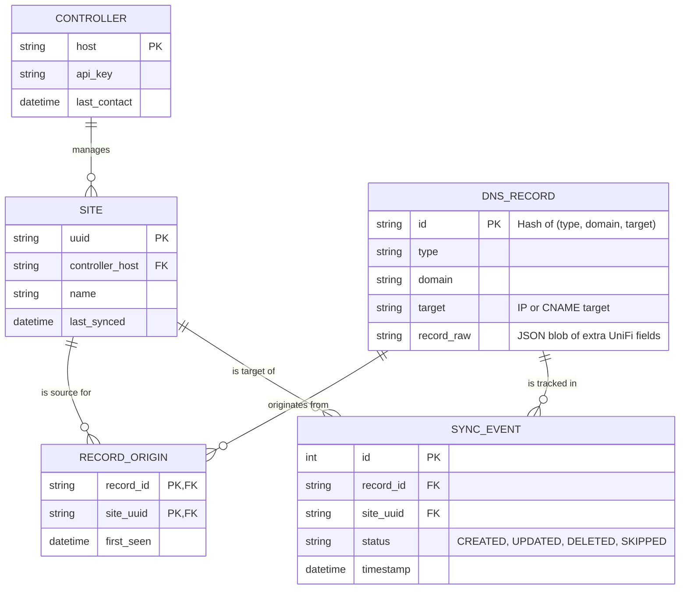

# SQLite Datastore Implementation Plan (Long Term)

This plan outlines the architecture for moving from an in-memory `record_map` to a persistent SQLite database. This transition will improve scalability for multi-site deployments and provide better auditability of "who synced what, when".

## Proposed Database Schema

## Proposed Changes

### 1. Data Layer Implementation
- **New Module**: `src/database.py` using standard `sqlite3` or `SQLAlchemy`.
- **Initialization**: Create tables on startup if they don't exist.
- **Persistence**: Store the database file in a persistent volume (e.g., `/data/dns_sync.db`).

### 2. Logic Refactoring
- **Discovery Phase**: 
    - For each controller, fetch all available sites.
    - Refresh the `SITE` table.
    - Fetch DNS/DHCP records for **every** configured site.
    - Populate the `DNS_RECORD` and `RECORD_ORIGIN` (linked to `site_uuid`).
- **Sync Phase**: 
    - Query `DNS_RECORD` for all desired records.
    - For each target `SITE`, query `RECORD_ORIGIN` to exclude records that originated from that specific site (or optionally from that entire controller).
    - Compare `DNS_RECORD` state with `SYNC_EVENT` or live controller state to determine if an update is needed.
- **Cleanup**: Identify records in the DB that no longer have any active origins (true deletion sync).

### 3. Features Enabled
- **Granular Origin Tracking**: We can now distinguish between different sites on the same hardware.
- **Sync History**: The `SYNC_EVENT` table allows us to log exactly when a specific record was pushed to a specific site.
- **Multi-Site Discovery**: Automatically discover all sites on a controller rather than requiring explicit configuration for each.

## Deployment Considerations

> [!IMPORTANT]
> **Persistence Requirements**: Using SQLite will require the Helm chart to support a Persistent Volume Claim (PVC) to ensure the database survives pod restarts.

> [!NOTE]
> **Performance**: For 100s of sites and 1000s of records, SQLite is perfectly adequate. It remains single-file and zero-config compared to Postgres/MySQL.
